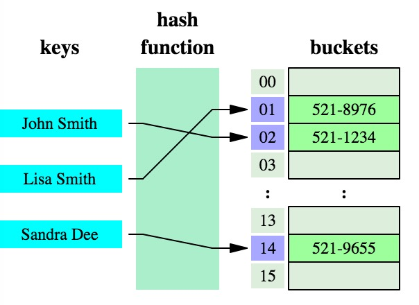
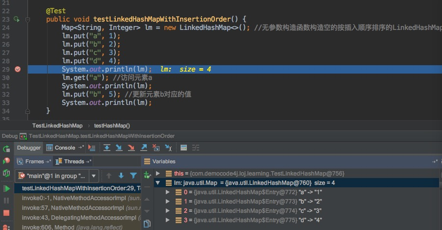
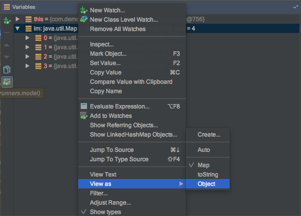
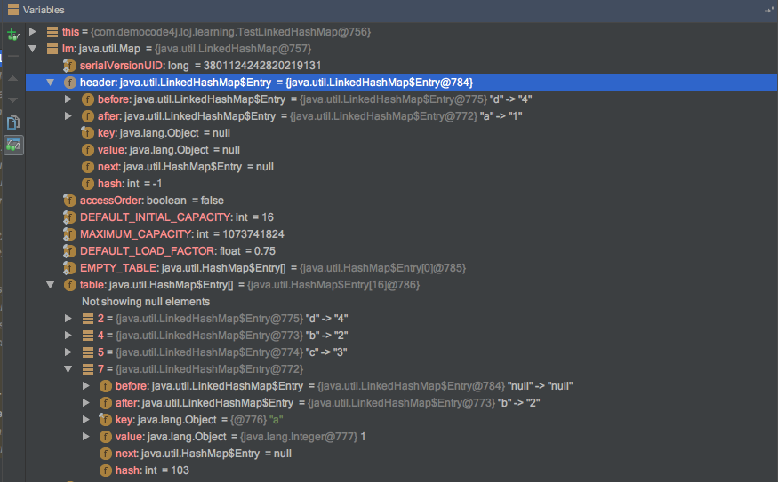
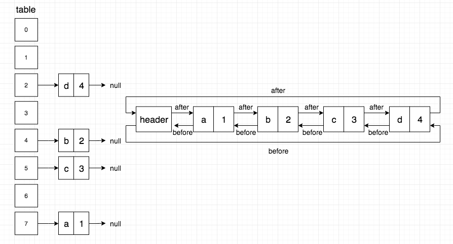
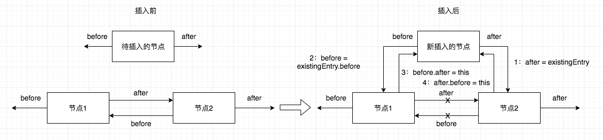
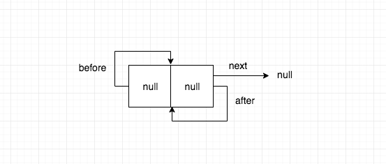
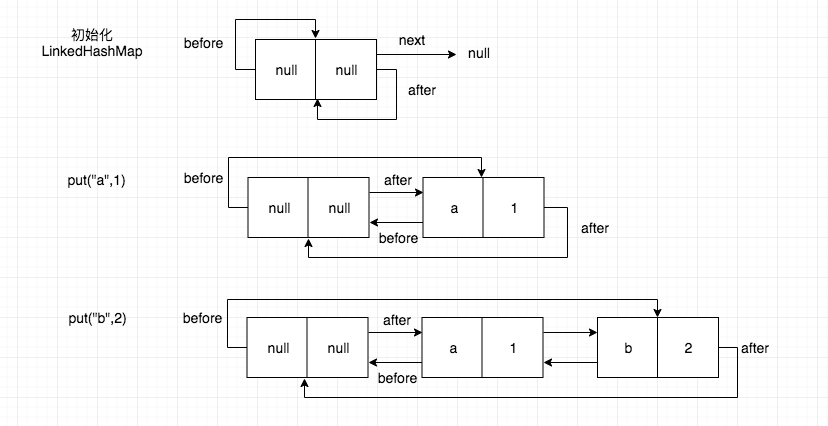

# LinkedHashMap源码分析

> 本文源码分析基于Oracle JDK 1.7.0_80

[TOC]

## 0x00 从HashMap说起

HashMap是一种基于哈希表（hash table）实现的map，其原理是：key经过哈希函数映射后得到一个槽（buckets）的索引（index），槽中保存着我们想要获取的值。



通过HashMap的源码分析可知，HashMap不保证内部元素的顺序，而且随着时间的推移，同一元素的位置都有可能发生改变（resize的情况）。

```java
@Test
public void testHashMap() {
    Map<String, Integer> map = new HashMap<>();
    map.put("a", 1);
    map.put("b", 2);
    map.put("c", 3);
    map.put("d", 4);
    System.out.println(map.toString());
    //结果打印:
    //{d=4, b=2, c=3, a=1}
}
```

该文分析的LinkedHashMap基于HashMap实现，由一个**双链表**来保证内部元素的有序性来解决有排序需求的场景。

## 0x01 LinkedHashMap概述
通过观察下面LinkedHashMap的部分源码我们可以发现，该类是通过双链表来保证内部元素的有序性。Entry继承了HashMap的Entry，并新增了`before`和`after`指针，形成了双链表。同时定义了一个`header`变量做为头节点。

```java
public class LinkedHashMap<K,V> extends HashMap<K,V. implements Map<K,V>
{
    /**
     * The head of the doubly linked list.
     */
    private transient Entry<K,V> header;
    
    /**
     * LinkedHashMap entry.
     */
    private static class Entry<K,V> extends HashMap.Entry<K,V> { 
        // These fields comprise the doubly linked list used for iteration.
        Entry<K,V> before, after;
    }
}
```

此外还可以发现LinkedHashMap多了一个变量`accessOrder`，该变量决定了LinkedHashMap内部元素的排序方式：

* 当`accessOrder`为false，按插入的顺序排序（insertion-order）
* 当`accessOrder`为true，按访问的顺序排序（access-order）

```java
/**
 * The iteration ordering method for this linked hash map: <tt>true</tt>
 * for access-order, <tt>false</tt> for insertion-order.
 *
 * @serial
 */
 private final boolean accessOrder;
```

接下来再来看一下LinkedHashMap的构造函数：

```java
/**
 * 根据传入的初始capacity和load factor两个参数构造一个空的按插入顺序排序的LinkedHashMap实例
 */
public LinkedHashMap(int initialCapacity, float loadFactor) {
    super(initialCapacity, loadFactor);
    accessOrder = false;
}

/**
 * 根据传入的初始capacity参数（load factor默认值0.75）构造一个空的按插入顺序排序的LinkedHashMap实例
 */
public LinkedHashMap(int initialCapacity) {
    super(initialCapacity);
    accessOrder = false;
}

/**
 * 无参数构造函数（初始capacity默认值16，load factor默认值0.75）构造一个空的按插入顺序排序的LinkedHashMap实例
 */
public LinkedHashMap() {
    super();
    accessOrder = false;
}

/**
 * 根据传入的Map对象构造一个有值的按插入顺序排序的LinkedHashMap，其中load factor默认值0.75
 */
public LinkedHashMap(Map<? extends K, ? extends V> m) {
    super(m);
    accessOrder = false;
}

/**
 * 根据传入的初始capacity、load factor和accessOrder参数构造一个空的按插入顺序排序的LinkedHashMap
 */
public LinkedHashMap(int initialCapacity,
                     float loadFactor,
                     boolean accessOrder) {
    super(initialCapacity, loadFactor);
    this.accessOrder = accessOrder;
}
```

根据以上LinkedHashMap的5种构造函数，我们可以看出前面4种构造函数中`accessOrder`的默认值都为`false`，也即默认都为按插入顺序排序。只有最后1种构造函数才允许通过传入`accessOrder`参数来构造按访问顺序排序的LinkedHashMap。

下面我们通过程序来验证：

```java
/**
 * 测试LinkedHashMap内部元素按插入顺序排序
 */
@Test
public void testLinkedHashMapWithInsertionOrder() {
    Map<String, Integer> lm = new LinkedHashMap<>();
    lm.put("a", 1);
    lm.put("b", 2);
    lm.put("c", 3);
    lm.put("d", 4);
    System.out.println(lm);
    lm.get("a"); //访问元素a
    System.out.println(lm);
    lm.put("b", 5); //更新元素b对应的值
    System.out.println(lm);
    //测试结果打印：
    //{a=1, b=2, c=3, d=4}
    //{a=1, b=2, c=3, d=4}
    //{a=1, b=5, c=3, d=4}
}
/**
 * 测试LinkedHashMap内部元素按访问顺序排序
 */
@Test
public void testLinkedHashMapWithAccessOrder() {
    Map<String, Integer> lm = new LinkedHashMap<String, Integer>(16, 0.75f, true);
    lm.put("a", 1);
    lm.put("b", 2);
    lm.put("c", 3);
    lm.put("d", 4);
    System.out.println(lm);
    lm.get("a");
    System.out.println(lm);
    lm.put("b", 5);
    System.out.println(lm);
    //测试结果打印：
    //{a=1, b=2, c=3, d=4}
    //{b=2, c=3, d=4, a=1}
    //{c=3, d=4, a=1, b=5}
}
```

从测试函数`testLinkedHashMapWithInsertionOrder`的结果可以看出无论是访问元素还是更新元素，最后打印LinkedHashMap内部元素的顺序都是按照插入的顺序进行排序。而在测试函数`testLinkedHashMapWithAccessOrder`中，访问元素a后，a元素被排到了末尾；更新元素b后，b元素到了最末尾。

## 0x02 深入LinkedHashMap

在测试函数`testLinkedHashMapWithInsertionOrder`中设置断点来看一下：



Intellij IDEA默认只显示Map对象的内部元素，要查看对象中其他的属性需要右击变量`View as Object`





可以看到LinkedHashMap对象中的头结点`header`内的`before`和`after`指针分别指向`Entry<d,4>`和`Entry<a,1>`。`Entry<a,1>`内的`after`指针指向`Entry<b,2>`。依次类推：header-> a（最老）->b->c->d（最新），正是由于`before`和`after`两个指针才形成了双链表保证了内部元素的可排序性。



接下来看一下LinkedHashMap内部是如何实现的。

### Entry类

LinkedHashMap的Entry类：

```java
/**
 * LinkedHashMap entry.
 */
private static class Entry<K,V> extends HashMap.Entry<K,V> {
    // These fields comprise the doubly linked list used for iteration.
    Entry<K,V> before, after;
    
    Entry(int hash, K key, V value, HashMap.Entry<K,V> next) {
        super(hash, key, value, next);
    }
    
    /**
     * Removes this entry from the linked list.
     */
    private void remove() {
        before.after = after;
        after.before = before;
    }
    
    /**
     * Inserts this entry before the specified existing entry in the list.
     */
    private void addBefore(Entry<K,V> existingEntry) {
        after  = existingEntry;
        before = existingEntry.before;
        before.after = this;
        after.before = this;
    }
    
    /**
     * This method is invoked by the superclass whenever the value
     * of a pre-existing entry is read by Map.get or modified by Map.set.
     * If the enclosing Map is access-ordered, it moves the entry
     * to the end of the list; otherwise, it does nothing.
     */
    void recordAccess(HashMap<K,V> m) {
        LinkedHashMap<K,V> lm = (LinkedHashMap<K,V>)m;
        if (lm.accessOrder) {
            lm.modCount++;
            //删除该节点
            remove();
            //把该节点添加至header前面
            addBefore(lm.header);
        }
    }
    
    void recordRemoval(HashMap<K,V> m) {
        remove();
    }
}
```

LinkedHashMap的Entry继承了HashMap.Entry，并且新增了`before`和`after`两个指向前后节点的指针。

下图为函数`addBefore`的示意图：



其中的`recordAccess`函数重写了HashMap.Entry中的`recordAccess`函数，该函数只有当节点被访问（get）或者修改（put）时才会被调用，并且当LinkedHashMap的节点排序为按访问顺序排序（access-ordered）时才会发生变化：删除被访问或者修改的节点，然后添加至头节点前。

### 构造方法

从HashMap的构造函数看起：

```java
public class HashMap<K,V>
    extends AbstractMap<K,V>
    implements Map<K,V>, Cloneable, Serializable
{
    /**
     * Constructs an empty <tt>HashMap</tt> with the specified initial
     * capacity and load factor.
     *
     * @param  initialCapacity the initial capacity
     * @param  loadFactor      the load factor
     * @throws IllegalArgumentException if the initial capacity is negative
     *         or the load factor is nonpositive
     */
    public HashMap(int initialCapacity, float loadFactor) {
        if (initialCapacity < 0)
            throw new IllegalArgumentException("Illegal initial capacity: " +
                                               initialCapacity);
        if (initialCapacity > MAXIMUM_CAPACITY)
            initialCapacity = MAXIMUM_CAPACITY;
        if (loadFactor <= 0 || Float.isNaN(loadFactor))
            throw new IllegalArgumentException("Illegal load factor: " +
                                               loadFactor);
    
        this.loadFactor = loadFactor;
        threshold = initialCapacity;
        init();
    }
    
    /**
     * Initialization hook for subclasses. This method is called
     * in all constructors and pseudo-constructors (clone, readObject)
     * after HashMap has been initialized but before any entries have
     * been inserted.  (In the absence of this method, readObject would
     * require explicit knowledge of subclasses.)
     */
    void init() {
    }
}
```

HashMap的构造函数中调用了`init()`函数，该函数（空函数）作为一个钩子函数（hook）可以通过在HashMap的子类中重写被调用。

以下代码片段为LinkedHashMap中重写的`init()`函数：

```java
/**
 * Called by superclass constructors and pseudoconstructors (clone,
 * readObject) before any entries are inserted into the map.  Initializes
 * the chain.
 */
@Override
void init() {
    header = new Entry<>(-1, null, null, null);
    header.before = header.after = header;
}
```

可以发现在`init()` 函数中对`header`进行了初始化，并且把`before`和`after`指针都指向了`header`自己本身。



### get方法：

LinkedHashMap对get方法进行了重写：

```java
public V get(Object key) {
    Entry<K,V> e = (Entry<K,V>)getEntry(key);
    if (e == null)
        return null;
    //如果LinkedHashMap中节点按访问顺序排序，则把找到的节点移动到头节点前面
    e.recordAccess(this);
    return e.value;
}
```

### put方法

LinkedHashMap继承了HashMap中的put方法，对其中的`addEntry`方法和`createEntry` 方法进行了重写。

```java
//======== 以下为HashMap的方法 =========
public V put(K key, V value) {
    if (table == EMPTY_TABLE) {
        inflateTable(threshold);
    }
    if (key == null)
        return putForNullKey(value);
    //计算key对应的哈希值以及对应的index值
    int hash = hash(key);
    int i = indexFor(hash, table.length);
    //遍历index值对应的链表，如果key相等，则更新key对应的value值
    for (Entry<K,V> e = table[i]; e != null; e = e.next) {
        Object k;
        if (e.hash == hash && ((k = e.key) == key || key.equals(k))) {
            V oldValue = e.value;
            e.value = value;
            e.recordAccess(this);
            return oldValue;
        }
    }
    //如果没有找到对应的key，则添加新节点
    modCount++;
    addEntry(hash, key, value, i);
    return null;
}

void addEntry(int hash, K key, V value, int bucketIndex) {
    if ((size >= threshold) && (null != table[bucketIndex])) {
        resize(2 * table.length);
        hash = (null != key) ? hash(key) : 0;
        bucketIndex = indexFor(hash, table.length);
    }
    
    createEntry(hash, key, value, bucketIndex);
}

void createEntry(int hash, K key, V value, int bucketIndex) {
    Entry<K,V> e = table[bucketIndex];
    table[bucketIndex] = new Entry<>(hash, key, value, e);
    size++;
}
```

```java
//======= 以下为LinkedHashMap重写的方法 =======

/**
 * This override alters behavior of superclass put method. It causes newly
 * allocated entry to get inserted at the end of the linked list and
 * removes the eldest entry if appropriate.
 * 
 * 重写addEntry方法
 */
void addEntry(int hash, K key, V value, int bucketIndex) {
    //调用HashMap的addEntry方法
    super.addEntry(hash, key, value, bucketIndex);
    
    //Remove eldest entry if instructed
    //如果有需要，删除最后的节点(header的after指针所指向的节点是最老的节点)
    Entry<K,V> eldest = header.after;
    if (removeEldestEntry(eldest)) {
        removeEntryForKey(eldest.key);
    }
}

/**
 * This override differs from addEntry in that it doesn't resize the
 * table or remove the eldest entry.
 *
 * 重写createEntry方法
 */
void createEntry(int hash, K key, V value, int bucketIndex) {
    HashMap.Entry<K,V> old = table[bucketIndex];
    Entry<K,V> e = new Entry<>(hash, key, value, old);
    table[bucketIndex] = e;
    //新节点e添加到头节点前面
    e.addBefore(header);
    size++;
}
```

对比LinkedHashMap的`createEntry`方法和HashMap的`createEntry`方法可以发现，LinkedHashMap的`createEntry`方法中多了一行代码`e.addBefore`，正是该行代码保证了内部节点的有序性。

下图为测试程序的图解：



## 0x03 LinkedHashMap应用之LRU Cache

由于LinkedHashMap内部元素的有序性，非常适合用来实现LRU（Least Recently Used，最近最少使用） Cache。

> LRU淘汰算法的核心思想：如果数据最近被访问过，那么将来被访问的几率也更高。

要实现LRU缓存，需要满足：

1. 新来的数据添加到缓存链表的头部
2. 缓存中的数据被访问（即缓存命中），则将数据移到链表的头部
3. 当缓存空间已满，需要将链表尾部的数据淘汰

如此看来，只需要将LinkedHashMap中的`accessOrder`值设为`true`就能满足链表中的数据按访问顺序排序，也即满足了1、2两点。至于第3点要求，则可以通过重新LinkedHashMap中的`removeEldestEntry`方法来实现清除最旧数据的策略。

LinkedHashMap中该方法默认返回false，表示不清理最旧的数据。

```java
protected boolean removeEldestEntry(Map.Entry<K,V> eldest) {
  	return false;
}
```

实现代码如下：

```java
package com.democode4j.loj.learning;

import java.util.LinkedHashMap;
import java.util.Map;

public class LRUCache<K, V> {

    private LRULinkedHashMap<K, V> cache;

    class LRULinkedHashMap<K, V> extends LinkedHashMap<K, V> {

        private final int capacity;

        public LRULinkedHashMap(int capacity) {
            //accessOrder设为true，元素按访问顺序排序
            super(capacity, 0.75f, true);
            this.capacity = capacity;
        }

        @Override
        protected boolean removeEldestEntry(Map.Entry<K, V> eldest) {
            //如果缓存空间已满，则清理最老的数据
            if (size() > capacity)
                return true;
            return false;
        }
    }

    public LRUCache(int capacity) {
        cache = new LRULinkedHashMap(capacity);
    }

    public V get(K key) {
        V result = cache.get(key);
        if (null == result)
            return null;
        return result;
    }

    public void put(K key, V value) {
        cache.put(key, value);
    }

    @Override
    public String toString() {
        return "LRUCache" + cache;
    }

    public static void main(String[] args) {
        LRUCache<String, Integer> lruCache = new LRUCache(3);
        lruCache.put("a", 1);
        lruCache.put("b", 2);
        lruCache.put("c", 3);
        System.out.println(lruCache);
        lruCache.get("a");
        System.out.println(lruCache);
        lruCache.put("b", 4);
        System.out.println(lruCache);
        lruCache.put("d", 5);
        System.out.println(lruCache);
        //结果打印
        //LRUCache{a=1, b=2, c=3}
        //LRUCache{b=2, c=3, a=1}
        //LRUCache{c=3, a=1, b=4}
        //LRUCache{a=1, b=4, d=5}
    }
}
```


## 0x04 总结

通过以上的源码分析，我们可以看出LinkedHashMap只是对HashMap进行了扩展，由双链表的插入操作时间复杂度O(1)可知，LinkedHashMap在时间开销上并不会比HashMap多太多。因此当需要一个内部元素有序的Map时，不妨选择使用LinkedHashMap，但是需要注意，同HashMap一样，LinkedHashMap并不支持并发。


> 参考：[JDK LinkedHashMap源码](https://docs.oracle.com/javase/7/docs/api/java/util/LinkedHashMap.html)

